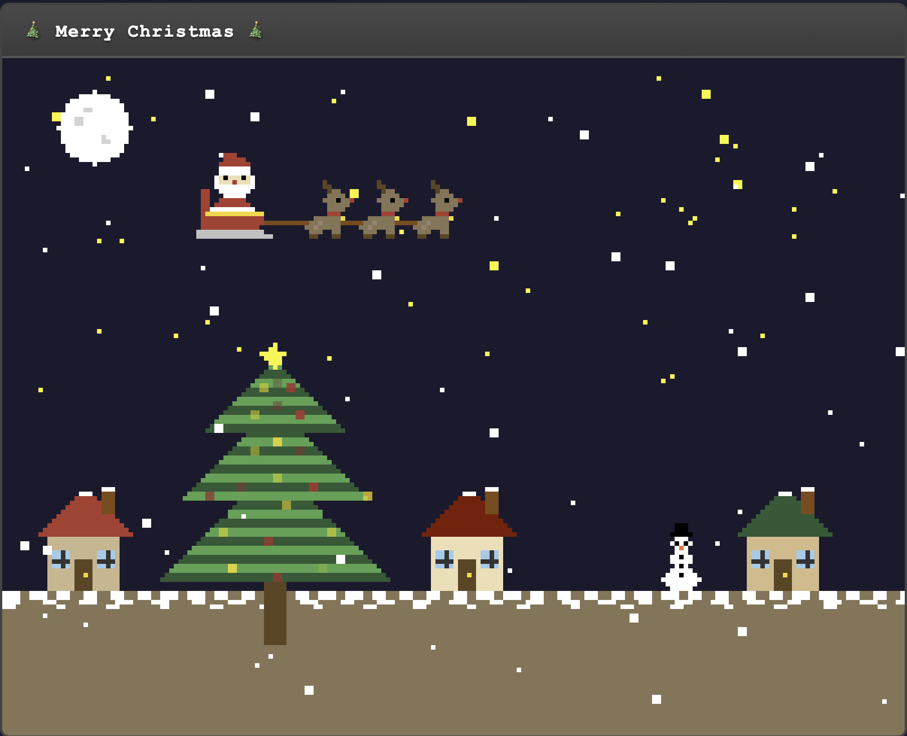

# 🎄 Christmas Pixel Art Animation

크리스마스 테마의 픽셀아트 애니메이션 웹 프로젝트입니다. 순수 HTML, CSS, JavaScript만을 사용하여 레트로 게임 스타일의 크리스마스 장면을 구현했습니다.

## 📸 미리보기



*화면을 클릭하면 산타의 썰매에서 선물이 떨어집니다!*

## ✨ 주요 기능

### 애니메이션 요소
- **눈 내리기**: 50개의 눈송이가 부드럽게 내려오는 효과
- **크리스마스 트리**: 반짝이는 조명으로 장식된 3단 트리
- **산타와 루돌프**: 산타가 3마리의 루돌프와 함께 썰매를 타고 하늘을 가로지릅니다
- **밤하늘**: 달과 별이 반짝이는 밤하늘
- **크리스마스 마을**: 눈 덮인 집 3채와 귀여운 눈사람

### 인터랙티브 기능
- **선물 떨어뜨리기**: 화면을 클릭하면 산타의 썰매에서 선물이 떨어집니다
- **파티클 효과**: 선물이 떨어질 때와 땅에 닿을 때 화려한 파티클 이펙트

## 🎮 사용 방법

1. 웹 브라우저에서 `index.html` 파일을 엽니다
2. 화면 아무 곳이나 클릭하여 선물을 떨어뜨립니다
3. 크리스마스 애니메이션을 감상합니다

## 📁 파일 구조

```
christmas-workspace/
├── index.html          # 메인 HTML 파일
├── styles.css          # 스타일시트
├── script.js           # JavaScript 애니메이션 로직
├── CLAUDE.md          # 프로젝트 상세 문서
└── README.md          # 프로젝트 소개 (현재 파일)
```

## 🎯 성능 최적화

- 클릭 이벤트 쓰로틀링 (0.5초 간격)
- 효율적인 파티클 관리 및 메모리 정리
- Canvas API 최적화

Merry Christmas! 🎄✨
